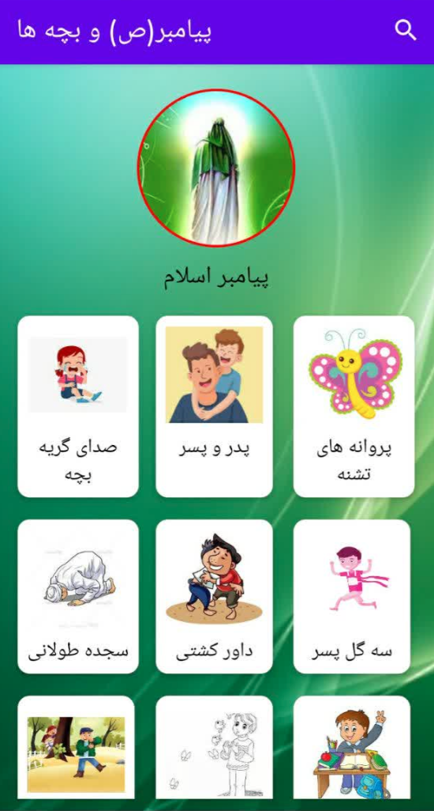
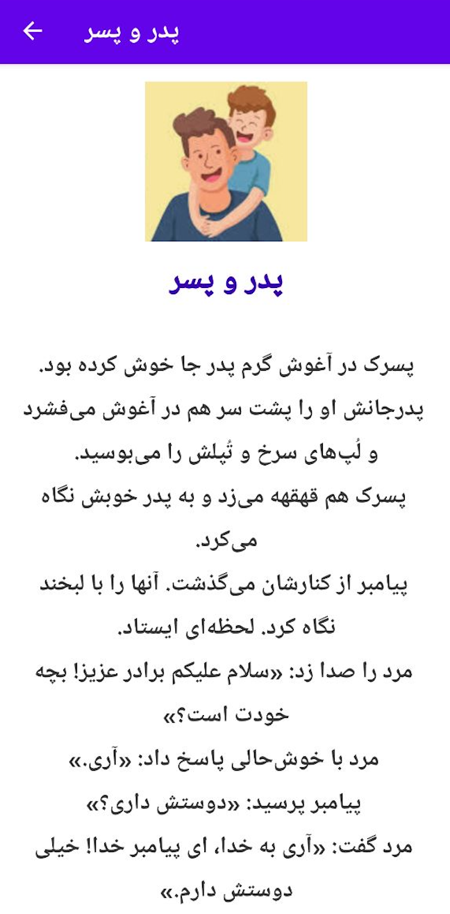

# Prophet-PBUH-and-children

A collection of stories about the behavior of the Prophet of Islam with children

## Table of Content 
- [specification](#specification)
- [libraries](#libraries)
- [screenshots](#screenshots)

## specification 
- 33 < SdkVersion > 23 (6 < AndroidVersion > 13)
- Kotlin 1.10.1

## libraries 
- constraintlayout
- lifecycle
- circleimageview

## ScreenShots 

HomePage

    

Page1

    

